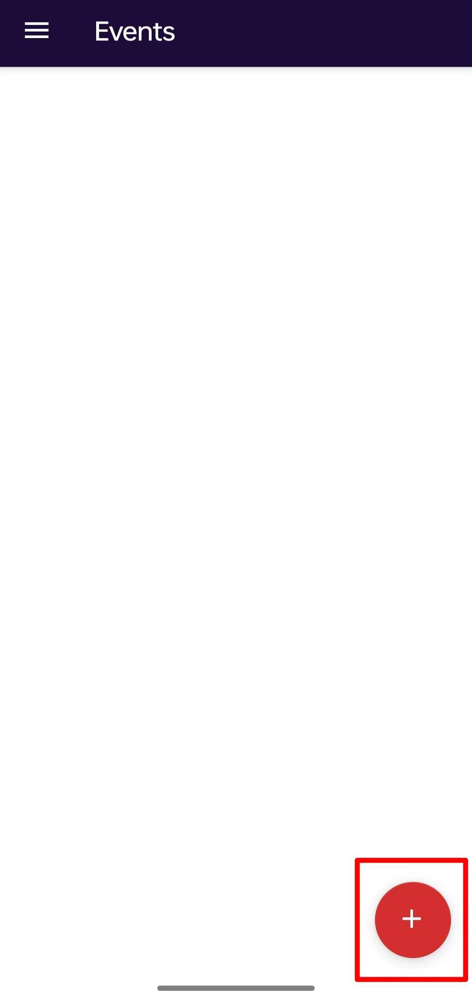

# 📱 EventPro – Smart Event Management Android App

### 📊 [View Live Infographic](https://anup-kumar2004.github.io/EventPro-Event-Management-Android-Application-/)  
### 📦 [Download EventPro APK](https://drive.google.com/your-shared-link-here)

---

**EventPro** is a powerful and user-friendly Android application that simplifies the management and participation in college or campus events. It connects hosts and participants in a seamless interface with real-time features and cloud integration.

---

## 🎯 Objective

> EventPro centralizes event creation, invitation, and participation for college environments with a goal to:

- 🧑‍💼 Enable hosts to create, edit, and manage events.
- 🧑‍🤝‍🧑 Allow users to browse, join, and track events.
- 🗓️ Improve overall accessibility, engagement, and organization of campus activities.

---

## 🧰 Tech Stack

| Layer              | Technologies & Tools                                |
|--------------------|------------------------------------------------------|
| **Frontend**       | Java, XML (Android Studio)                          |
| **Authentication** | Firebase Auth (Email/Password, Google Sign-In)      |
| **Database**       | Firebase Realtime Database                          |
| **Cloud Services** | Google Cloud Console                                |
| **UI Components**  | RecyclerView, CardView, Navigation Drawer           |
| **Version Control**| Git, GitHub                                          |

---

## 🚀 Features Overview

### 🔐 User Authentication
- Login/Register via Email or Google Sign-In
- Unique UID assigned for every user

### 🧑‍💼 Host Panel
- Create, edit, or delete events
- Invite users by email
- Track and view event participants

### 🧑‍🎓 Participant Panel
- Browse and join available events
- View and manage invitations
- Track your joined events

---

## 📷 Screenshots

  
<strong>Authentication Flow</strong>

  
<strong>Host Features</strong>

  
<strong>Participant Features</strong>

---

## 🛡️ Permissions

This app requires the following permissions:

- `INTERNET` – For Firebase data communication
- `ACCESS_NETWORK_STATE` – To check internet connectivity
- Additional permissions if extended for location/calendar features

---

## 🧪 Future Enhancements

- 📍 Add location-based event filtering
- 📅 Integrate Google Calendar sync
- 🔔 Push notifications for upcoming events
- 📝 Feedback form for participants

---

## 🤝 Contribution

Feel free to fork the project, raise issues, or submit PRs!  
Pull requests are welcome. For major changes, please open an issue first to discuss what you would like to change.

---

## 📄 License

This project is licensed under the [MIT License](LICENSE).

---

## 🙋‍♂️ Developed By

**Anup Kumar**  
[📧 Email](mailto:youremail@example.com) • [🌐 Portfolio](https://your-portfolio-link.com) • [📍 LinkedIn](https://linkedin.com/in/your-profile)

