# 📱 EventPro – Smart Event Management Android App

**EventPro** is a full-featured Android application designed to streamline the process of hosting and attending events, particularly within college campuses where multiple activities run concurrently. The app provides both hosts and participants with a seamless, centralized platform to manage and engage in event activities.

Developed using **Java and XML** in **Android Studio**, EventPro is powered by a robust **Firebase** backend, leveraging:
- 🔐 Firebase Authentication (Email & Google Sign-In via OAuth 2.0)
- ☁️ Firebase Realtime Database
- 🌐 Google Cloud Console for OAuth integration and project management

---

## 🎯 Objective

The primary aim of EventPro is to provide an intuitive and centralized platform where:

- 🧑‍💼 **Hosts** can easily create, manage, and invite users to events.
- 🧑‍🤝‍🧑 **Users** can browse, join, or respond to event invitations in a structured environment.
- 📆 College events become more organized, engaging, and accessible to everyone.

---

## 🔧 Tech Stack & Tools Used

| Category           | Technologies / Tools                                |
|--------------------|------------------------------------------------------|
| **Frontend**       | Java, XML (Android Studio)                          |
| **Authentication** | Firebase Authentication, Google Sign-In (OAuth 2.0) |
| **Database**       | Firebase Realtime Database                          |
| **Cloud Services** | Google Cloud Console                                |
| **UI Components**  | RecyclerView, CardView, Navigation Drawer           |
| **Version Control**| Git & GitHub                                         |

---

## 🧭 App Workflow

### 🔐 Step 1: User Authentication

Users can log in via:
- **Email/Password**
- **Google Sign-In**

Each user is assigned a **unique UID** for personalized data handling.

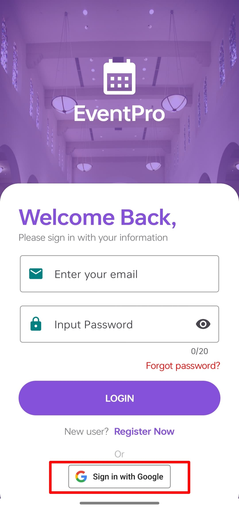
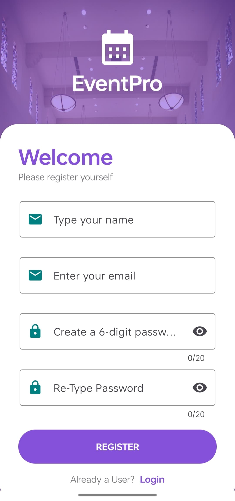
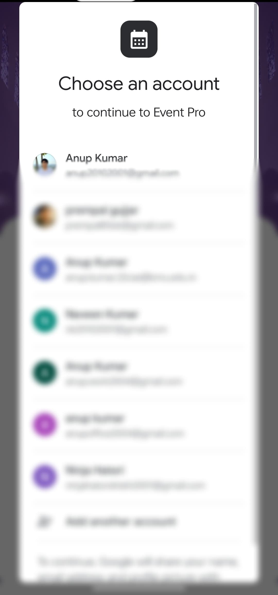

---

### 🚦 Step 2: Choose to Host or Join Event

After login, users are prompted to select between:
- **Hosting an Event**
- **Joining an Event**

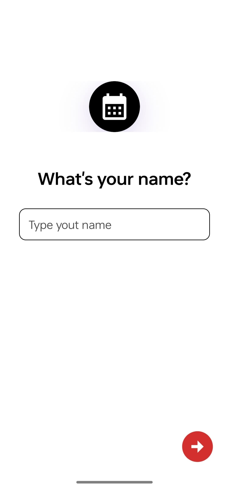
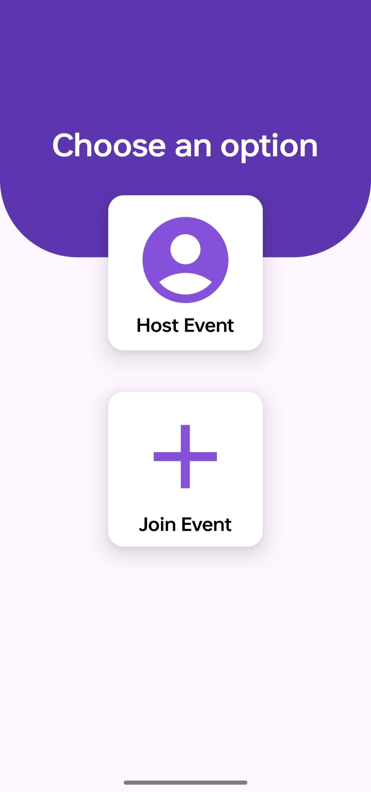

---

### 🏗️ Step 3: Host an Event

Hosts can:
- Create a new event with name, date, time, and details
- View their hosted events
- Edit or delete existing events

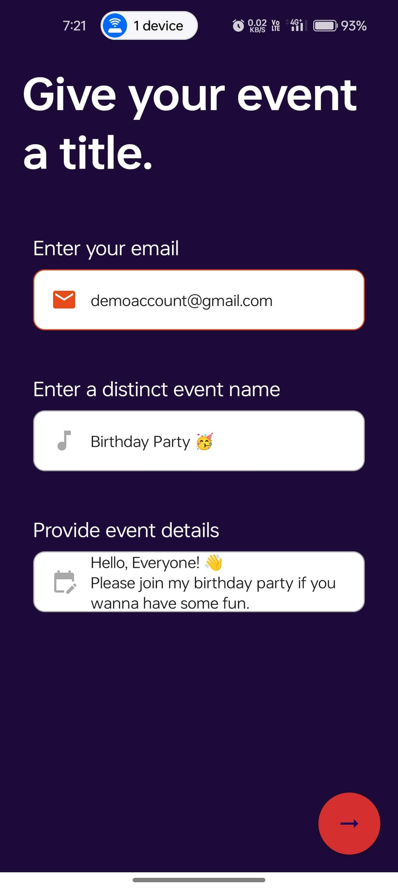

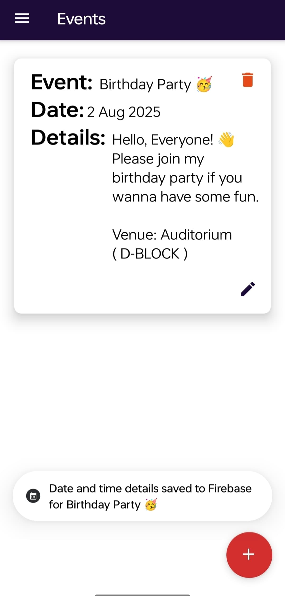
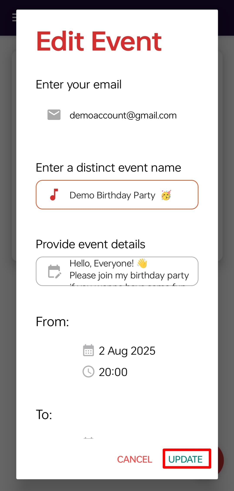

---

### ✉️ Step 4: Invite Users

Hosts can invite other users to their events using email. Invites show up in the invitee’s dashboard.

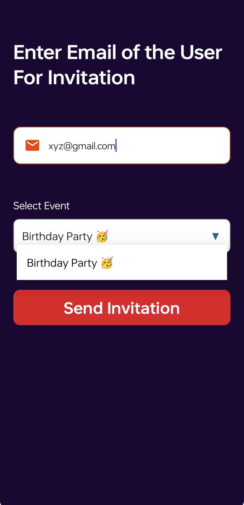

---

### 🧑‍🤝‍🧑 Step 5: View Participants

Hosts can view the list of users who have joined their events.

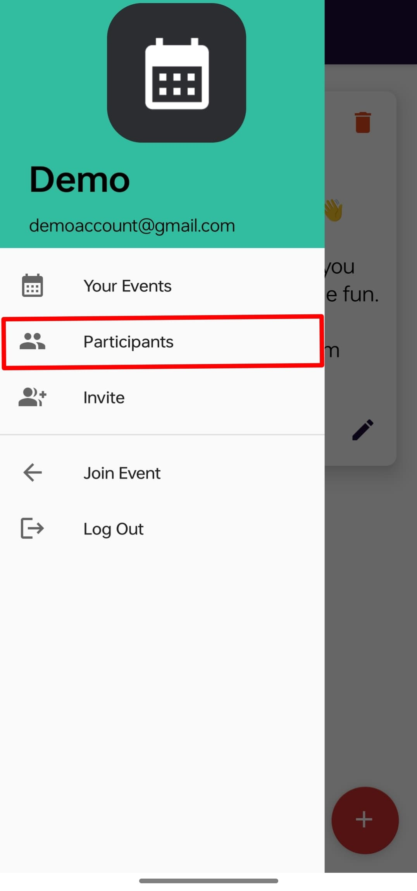
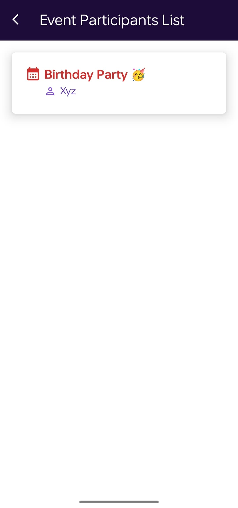

---

### 🎟️ Step 6: Join Event

Users can:
- Browse all available events
- Join events they are interested in
- View their joined events in a separate tab

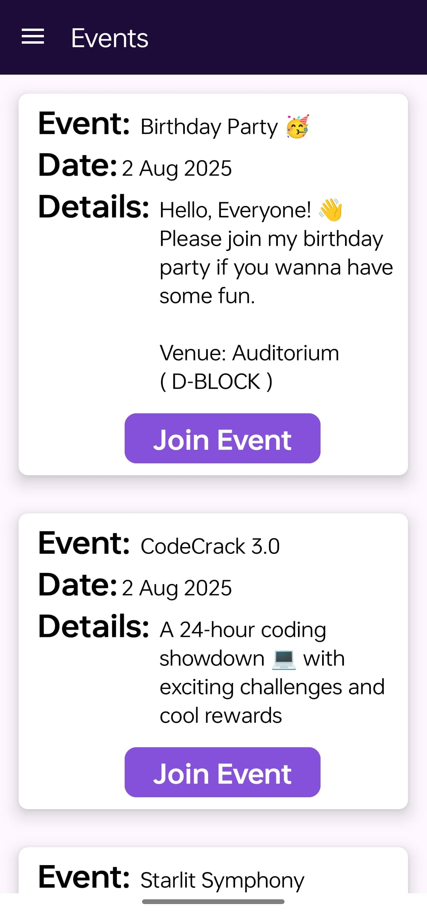
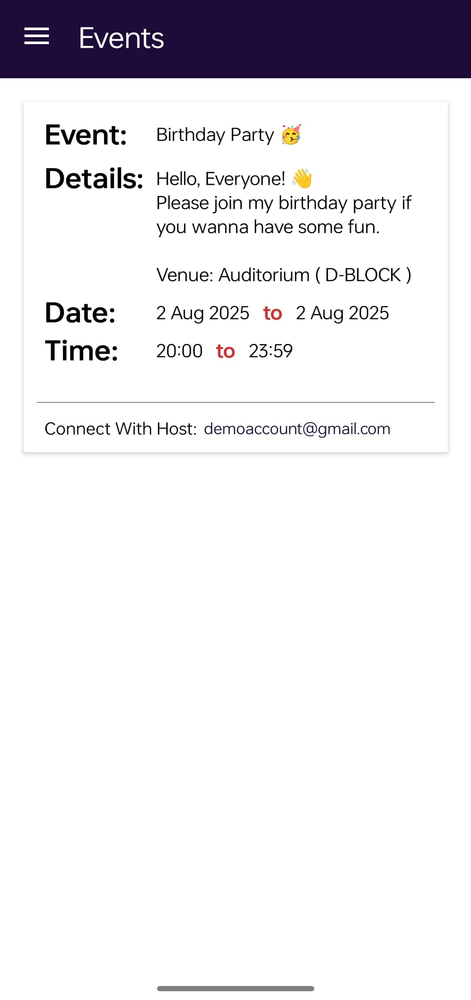

---

### 📨 Step 7: Invited Events

Users can view and respond to event invitations from hosts with **Accept** or **Decline** options.

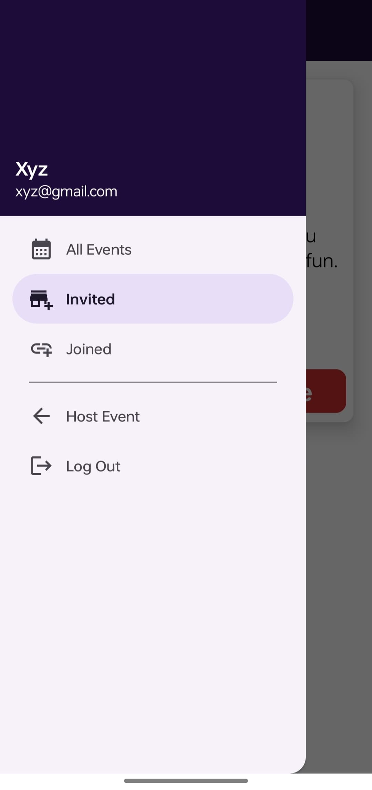
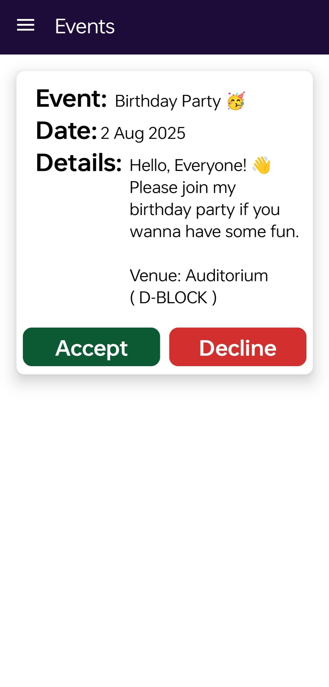

